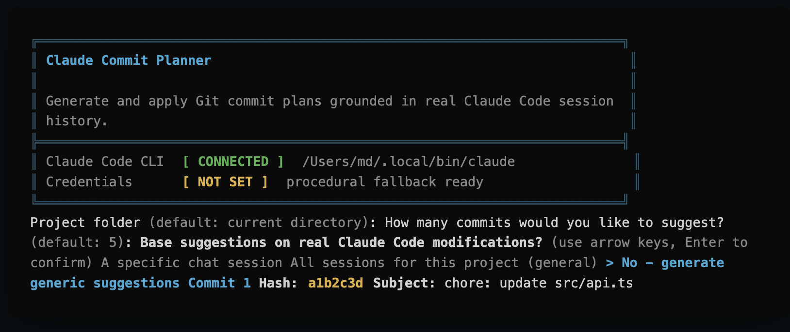

# Claude Commit Planner

Un CLI interactif qui génère (et applique, si vous le souhaitez) des plannings de commits Git réalistes — basés sur ce que Claude Code a **réellement** fait pendant vos sessions de chat, pas sur des suppositions.



(Une application web compagnon était prévue à l'origine ; elle n'est pas implémentée aujourd'hui — voir la note en fin de document.)

---

## Pour les utilisateurs

### Ce que fait l'outil

1. Vous pointez l'outil vers un dossier de projet.
2. Vous choisissez la base des suggestions :
   - une **session de chat Claude Code précise**,
   - **toutes les sessions** de ce projet (agrégées),
   - ou aucune base réelle (suggestions génériques).
3. L'outil reconstruit l'historique réel des modifications de fichiers (via les sauvegardes de versions de Claude Code, `~/.claude/file-history/`), et découpe ce travail en N commits cohérents et chronologiques — même un seul fichier édité plusieurs fois peut devenir plusieurs commits distincts.
4. Il propose d'**appliquer** ces commits pour de vrai dans votre dépôt Git (avec confirmation explicite), avec les bonnes dates, le bon auteur (votre config Git locale), et — si le dossier n'est pas encore un dépôt — propose de faire `git init` et de configurer un remote (optionnel).

### Prérequis

- **Node.js** v20 ou supérieur (LTS recommandé)
- **npm**
- **Git** (pour les fonctionnalités de scan/application de commits)
- Optionnel : [`@anthropic-ai/claude-code`](https://www.npmjs.com/package/@anthropic-ai/claude-code) installé globalement, pour une génération de messages de commit par IA en utilisant votre abonnement/config Claude Code existante

### Installation

```bash
npm install
```

### Lancer le CLI

```bash
npm run cli
```

L'outil boucle : à la fin de chaque planning (généré et appliqué ou non), il demande si vous voulez en générer un autre, sans avoir à relancer la commande.

### D'où viennent les messages de commit ?

L'outil essaie, dans cet ordre :

1. **Le CLI Claude Code local** (`claude`), s'il est détecté sur votre `PATH` — utilise votre configuration/abonnement existant, avec streaming en temps réel de la génération.
2. **Une clé API** (`ANTHROPIC_API_KEY` / `CLAUDE_API_KEY` ou `GEMINI_API_KEY`), si définie dans votre environnement ou dans un fichier `.env` local.
3. **Un générateur procédural hors-ligne**, qui fonctionne sans aucune IA — regroupe les changements réels par fichier/étape et rédige des messages de commit basiques mais fondés sur le travail réellement effectué.

Quelle que soit la méthode, l'**auteur** et les **dates** des commits appliqués correspondent toujours à votre configuration Git locale et aux vrais horodatages des changements — jamais des valeurs inventées.

### Configuration des clés API (optionnel)

```bash
cp .env.example .env
```

```env
ANTHROPIC_API_KEY="votre_cle_claude_ici"
# ou, en secours :
GEMINI_API_KEY="votre_cle_gemini_ici"
```

Sans clé et sans CLI Claude Code local détecté, l'outil reste entièrement utilisable grâce au générateur procédural.

### Compiler en exécutable autonome (sans Node.js requis)

Pour distribuer l'outil sans que la personne qui l'utilise ait besoin d'installer Node.js/npm :

```bash
npm run compile
```

Ceci génère 4 exécutables autonomes dans `dist/bin/` :

```
commit-planner-linux-x64
commit-planner-macos-arm64
commit-planner-macos-x64
commit-planner-win-x64.exe
```

Chacun embarque son propre runtime Node.js (~45-55 Mo non compressé) — aucune installation requise côté utilisateur final. `git` (et `claude`, si vous voulez l'IA locale) doivent toujours être présents sur la machine qui exécute le binaire.

Les assets publiés sur les releases GitHub sont compressés (`.gz` pour macOS/Linux, `.zip` pour Windows) — environ **60-65% plus légers à télécharger** que les binaires bruts. `installers/install.sh`/`installers/install.ps1` les décompressent automatiquement avec des outils déjà présents sur chaque OS (`gzip`, `Expand-Archive`) — aucune dépendance supplémentaire à installer.

### Installer la commande `cmt`

#### En ligne, sans cloner le dépôt

**macOS / Linux :**
```bash
curl -fsSL https://raw.githubusercontent.com/FabrichJean/c-commit/main/installers/install.sh | bash
```

**Windows (PowerShell) :**
```powershell
irm https://raw.githubusercontent.com/FabrichJean/c-commit/main/installers/install.ps1 | iex
```

Ceci télécharge directement le binaire adapté à votre OS/architecture depuis la [dernière release GitHub](https://github.com/FabrichJean/c-commit/releases/latest) — aucun clone, aucun Node.js requis.

#### Depuis un clone local

```bash
npm run install:cli
# ou directement :
./installers/install.sh          # macOS / Linux
.\installers\install.ps1          # Windows (PowerShell)
```

Dans ce cas, le script compile le binaire localement (`npm run compile`) s'il n'existe pas encore dans `dist/bin/`.

#### Dans tous les cas

Le script détecte automatiquement votre OS/architecture puis installe l'exécutable sous le nom `cmt` (`cmt.exe` sur Windows) dans `~/.local/bin` (ou `%LOCALAPPDATA%\cmt` sur Windows — configurable via la variable `CMT_INSTALL_DIR`). Si ce dossier n'est pas déjà dans votre `PATH`, le script vous indique la ligne à ajouter à votre profil de shell.

Si `cmt` est déjà installé, le script le détecte et vous demande confirmation avant d'écraser l'installation existante (avec la commande de désinstallation en rappel, au cas où).

Une fois installé :
```bash
cmt
```

### Mettre à jour

```bash
cmt update
# ou : cmt upgrade
```

Vérifie la dernière release GitHub par rapport à votre version actuelle (`cmt --version`) — si elle est déjà à jour, ne télécharge rien. Sinon, télécharge le binaire correspondant à votre plateforme (avec barre de progression), l'installe à la place de l'exécutable en cours d'utilisation (re-signature ad-hoc automatique sur macOS). Ne fonctionne que dans le binaire compilé — pas via `npm run cli` / `tsx`, où `git pull` fait office de mise à jour.

### Désinstaller

**macOS / Linux :**
```bash
npm run uninstall:cli
# ou en ligne, sans clone :
curl -fsSL https://raw.githubusercontent.com/FabrichJean/c-commit/main/installers/uninstall.sh | bash
```

**Windows (PowerShell) :**
```powershell
.\installers\uninstall.ps1
# ou en ligne :
irm https://raw.githubusercontent.com/FabrichJean/c-commit/main/installers/uninstall.ps1 | iex
```

### Application web compagnon

Une ancienne itération du projet prévoyait un tableau de bord web (React + Vite) en complément du CLI. Il n'est aujourd'hui pas implémenté — il n'en reste que des types partagés orphelins dans `src/types.ts` (aucun script `dev`/`build` correspondant dans `package.json`). À ignorer sauf si vous comptez reprendre cette partie.

---

## Pour les contributeurs

### Structure du projet

```
src/main.ts              → point d'entrée du CLI : arguments (--version, update), chargement .env, boucle interactive
src/planner.ts            → orchestration du planificateur interactif (runCommitPlanner)
src/git.ts                → primitives Git/fichiers (auteur, dates, git init, fichiers non suivis...)
src/claude-sessions.ts     → découverte et parsing des sessions Claude Code (~/.claude/projects)
src/commit-units.ts        → reconstruction chronologique, découpage fin, application réelle des commits
src/claude-cli.ts          → détection et appel en streaming du CLI Claude Code local
src/procedural.ts          → générateur de commits hors-ligne (repli sans IA)
src/self-update.ts         → `cmt update` (téléchargement avec progression, décompression, remplacement du binaire)
src/version.ts             → résolution de la version (`__CMT_VERSION__` injecté au build, ou repli sur package.json en dev)
src/ui/                   → couche terminal : couleurs (colors.ts), prompts/sélecteur à flèches (prompt.ts), bannière (banner.ts), curseur (terminal.ts)
src/diff.d.ts              → déclaration de types locale pour le paquet `diff` (qui n'en fournit pas)
src/globals.d.ts           → déclaration de `__CMT_VERSION__`
src/types.ts               → types hérités de l'ancienne app web compagnon, non utilisés par le CLI
scripts/build-cli.mjs    → bundle src/main.ts avec esbuild, en y injectant la version de package.json
scripts/release.mjs      → bump package.json + commit + tag, en une seule action atomique (npm run release)
installers/install.sh, install.ps1     → installent le binaire compilé sous la commande `cmt`
installers/uninstall.sh, uninstall.ps1 → retirent `cmt`
docs/preview.png         → capture d'écran utilisée dans ce README
.github/workflows/release.yml → compile et publie les 4 binaires sur chaque tag `v*`
```

### Architecture du CLI

Grandes étapes du pipeline, réparties sur plusieurs modules sous `src/` :

1. **Détection des sessions Claude Code** (`src/claude-sessions.ts`) — `locateClaudeCodeDir()`, `encodeProjectPath()` (reproduit l'encodage utilisé par Claude Code pour `~/.claude/projects/<encodé>`), `findProjectSessions()`, `summarizeSession()`, `extractFileChanges()` (parcourt les blocs `tool_use` — `Edit`, `MultiEdit`, `Write`, `NotebookEdit` — des transcripts `.jsonl`).
2. **Reconstruction chronologique** (`src/commit-units.ts`) — `buildCommitUnits()` lit les sauvegardes de versions de fichiers de Claude Code (`~/.claude/file-history/<session>/<hash>@vN`) pour retrouver l'état réel de chaque fichier à chaque étape (à défaut d'historique, diff contre `HEAD`) ; `buildCommitUnitsFromGitDiff()` fait la même chose directement depuis `git status` quand aucune session n'est utilisée.
3. **Découpage fin** (`src/commit-units.ts`) — diff ligne-à-ligne (paquet `diff`) via `expandUnitsToCount()` pour subdiviser une modification en plusieurs commits quand le nombre de "vraies" étapes est insuffisant par rapport au nombre demandé.
4. **Génération des messages** — CLI Claude local en streaming (`src/claude-cli.ts`), puis API Anthropic/Gemini, puis générateur procédural (`src/procedural.ts`), dans cet ordre de priorité — orchestré depuis `src/planner.ts`.
5. **Application réelle** (`src/commit-units.ts`) — `applyCommitUnits()` écrit chaque état historique sur disque, commit, puis restaure garantit l'état réel du fichier (`try/finally`), même en cas d'erreur en cours de route.

### Commandes utiles

```bash
npm run cli        # lance le CLI en mode développement (via tsx, pas de build requis)
npm run lint        # tsc --noEmit — à faire passer avant tout commit
npm run build:cli    # bundle src/main.ts en un seul fichier CJS (dist/cli.cjs)
npm run compile      # build:cli + génère les 4 exécutables autonomes (voir plus haut)
```

### Publier une nouvelle release (binaires `cmt`)

`package.json` est la source de vérité pour la version — elle est embarquée dans le binaire au build (`__CMT_VERSION__`, injecté par `scripts/build-cli.mjs`) et exposée via `cmt --version`. Un tag Git créé séparément d'un bump de `package.json` peut diverger (le tag pointe sur un commit figé, il ne "suit" pas les changements ultérieurs) — `npm run release` fait donc les deux ensemble, en une seule action atomique :

```bash
npm run release -- 0.1.6
# ou un incrément semver : npm run release -- patch / minor / major
```

Ceci bump `package.json` (et `package-lock.json`), commit, et crée le tag `vX.Y.Z` correspondant localement — sans rien pousser. Le script affiche la commande de push à la fin ; l'exécuter déclenche réellement la release :

```bash
git push origin main v0.1.6
```

Le workflow `.github/workflows/release.yml` vérifie d'abord que le tag poussé correspond bien à `package.json` (échoue sinon — filet de sécurité si jamais vous avez tagué à la main), puis compile les 4 binaires, les compresse (`.gz`/`.zip`) et les attache automatiquement à une release GitHub.

C'est ce qui alimente le script d'installation en ligne (`install.sh`/`install.ps1`) et `cmt update`, qui téléchargent toujours les assets de la **dernière** release — et `cmt update` compare désormais cette version à `cmt --version` pour savoir si une mise à jour est nécessaire.
